# [Soft UI Dashboard PRO TALL](https://soft-ui-dashboard-pro-tall.creative-tim.com/)

 

[](https://github.com/creativetimofficial/soft-ui-dashboard-pro-tall/issues?q=is%3Aopen+is%3Aissue) 
[](https://github.com/creativetimofficial/soft-ui-dashboard-pro-tall/issues?q=is%3Aissue+is%3Aclosed)

*Frontend version*: Soft UI Dashboard PRO Tailwind v1.0.0. More info at https://www.creative-tim.com/product/soft-ui-dashboard-pro-tailwind
[ ](https://soft-ui-dashboard-pro-tall.creative-tim.com/)

Speed up your web development with the Tailwind Admin Dashboard built for Laravel Framework 9.x and up.

## Table of Contents
* [Prerequisites](#prerequisites)
* [Installation](#installation)
* [Usage](#usage)
* [Versions](#versions)
* [Demo](#demo)
* [Documentation](#documentation)
* [Login](#login)
* [Register](#register)
* [Forgot Password](#forgot-password)
* [Reset Password](#reset-password)
* [User Profile](#my-profile)
* [User Management](#user-management)
* [Role Management](#role-management)
* [Category Management](#category-management)
* [Tag Management](#tag-management)
* [File Structure](#file-structure)
* [Browser Support](#browser-support)
* [Reporting Issues](#reporting-issues)
* [Licensing](#licensing)
* [Useful Links](#useful-links)
* [Social Media](#social-media)
* [Credits](#credits)

## Prerequisites

If you don't already have an Apache local environment with PHP and MySQL, use one of the following links:

 - Windows: https://updivision.com/blog/post/beginner-s-guide-to-setting-up-your-local-development-environment-on-windows
 - Linux & Mac: https://updivision.com/blog/post/guide-what-is-lamp-and-how-to-install-it-on-ubuntu-and-macos


Also, you will need to install Composer: https://getcomposer.org/doc/00-intro.md   
And Laravel: https://laravel.com/docs/10.x


## Installation
1. Unzip the downloaded archive
2. Copy and paste **soft-ui-dashboard-pro-tall-main** folder in your **projects** folder. Rename the folder to your project's name
3. In your terminal run `composer install`
4. Copy `.env.example` to `.env` and updated the configurations (mainly the database configuration and email credentials, also do not forget to also change APP_URL as it is used in some of the files)
5. In your terminal run `php artisan key:generate`
6. Run `php artisan migrate --seed` to create the database tables and seed the roles and users tables
7. Run `php artisan storage:link` to create the storage symlink (if you are using **Vagrant** with **Homestead** for development, remember to ssh into your virtual machine and run the command from there).


## Usage
Register a user or login with the default users with different roles from your database and start testing (make sure to run the migrations and seeders for these credentials to be available):
* **admin@softui.com** and password **secret**
* **creator@softui.com** and password **secret**
* **member@softui.com** and password **secret**

Besides the numerous types of dashboard, you can find pages for editing your profile, pages for managing the users, the roles, the items, the categories and the tags. There are also static pages for profile, for users, for projects, for accounts, for various applications, for ecommerce and different styles of pages for authentication. All the necessary files are installed out of the box and all the needed routes are added to `routes/web.php`. Keep in mind that all of the features can be viewed once you login using the credentials provided or by registering your own user. 


## Versions

[](https://www.creative-tim.com/product/soft-ui-dashboard-pro-tailwind)
[](https://www.creative-tim.com/product/soft-ui-dashboard-pro-laravel)


| HTML Tailwind | Laravel | TALL Stack |
| --- | --- | --- |
| [](https://www.creative-tim.com/product/soft-ui-dashboard-pro-tailwind) | [](https://www.creative-tim.com/product/soft-ui-dashboard-pro-laravel)  | [](https://www.creative-tim.com/product/soft-ui-dashboard-pro-tall)  |


## Demo
| Register | Login | Forgot Password Page |
| --- | --- | --- |
| [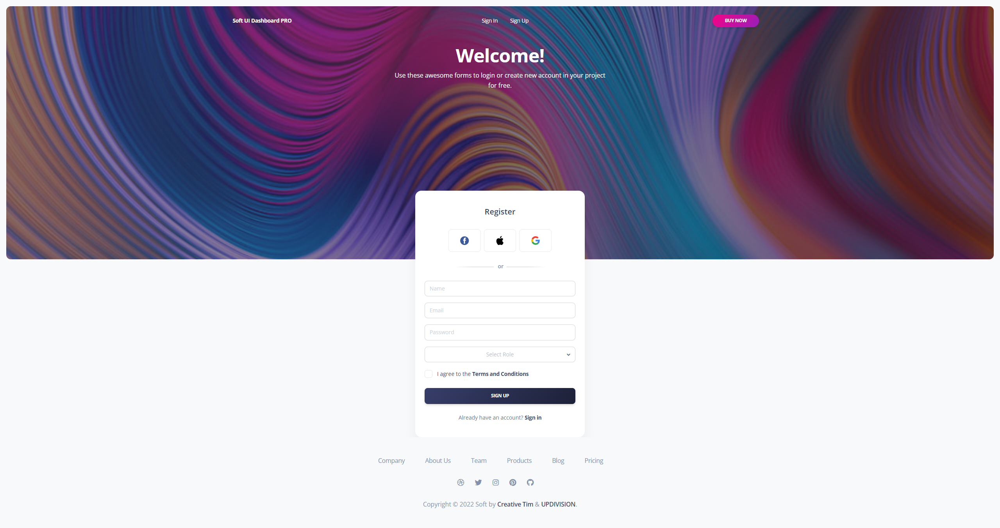](https://soft-ui-dashboard-pro-tall.creative-tim.com/sign-up) | [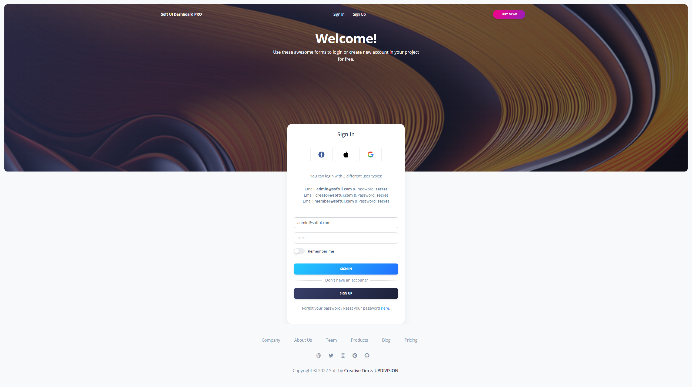](https://soft-ui-dashboard-pro-tall.creative-tim.com/sign-in) | [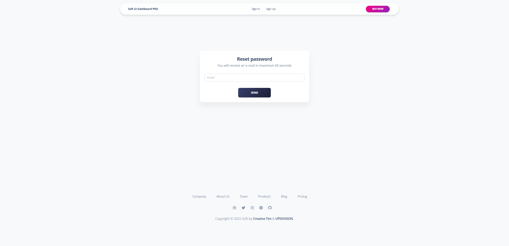](https://soft-ui-dashboard-pro-tall.creative-tim.com/forgot-password)

| Reset Password Page | User Profile | User Management |
| --- | --- | --- |
| [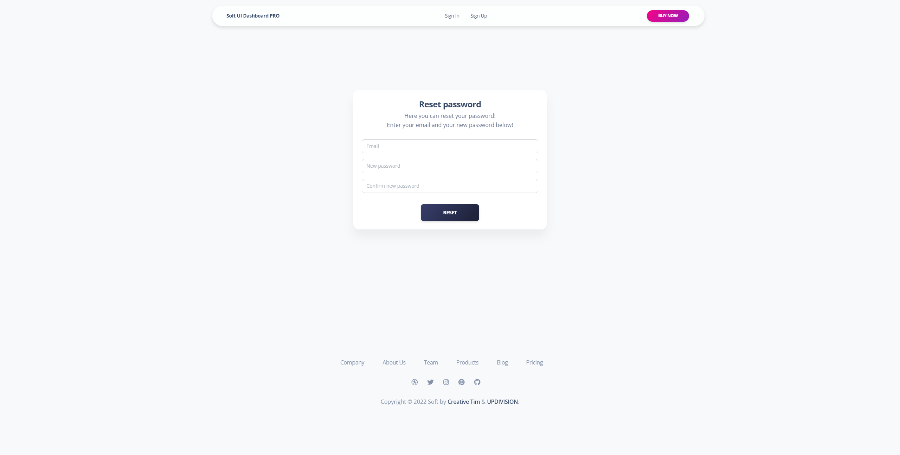](https://soft-ui-dashboard-pro-tall.creative-tim.com/sign-in) | [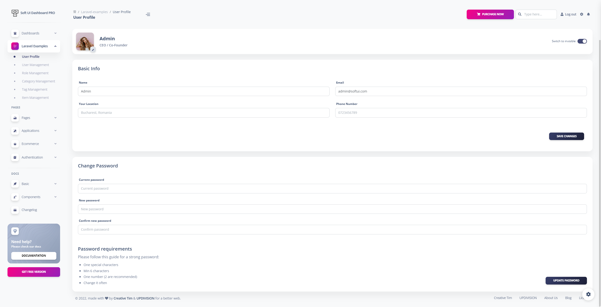](https://soft-ui-dashboard-pro-tall.creative-tim.com/laravel-examples/user-profile) | [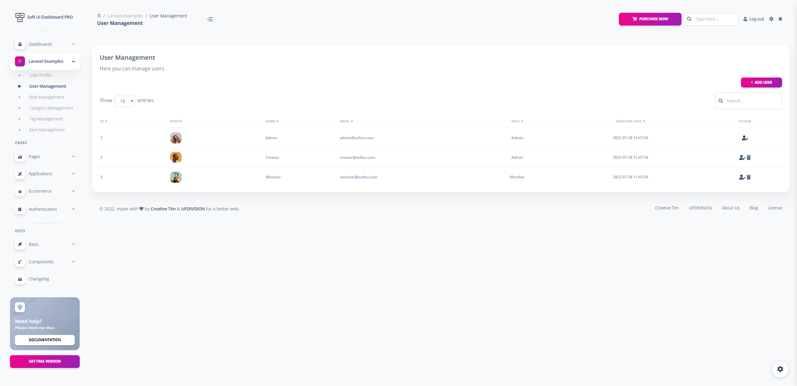](https://soft-ui-dashboard-pro-tall.creative-tim.com/laravel-examples/user-management)

| Role Management | Category Management | Tag Management |
| --- | --- | --- |
| [](https://soft-ui-dashboard-pro-tall.creative-tim.com/laravel-examples/role-management) | [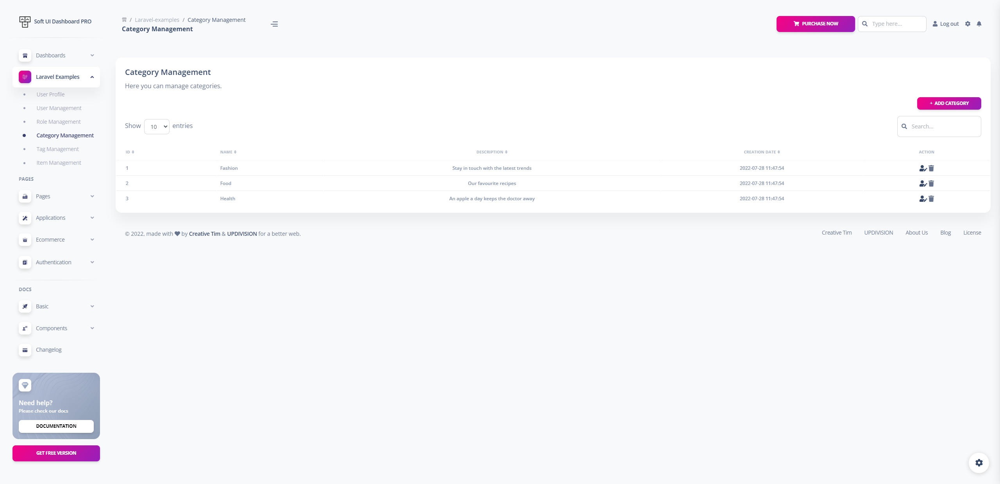](https://soft-ui-dashboard-pro-tall.creative-tim.com/laravel-examples/category) | [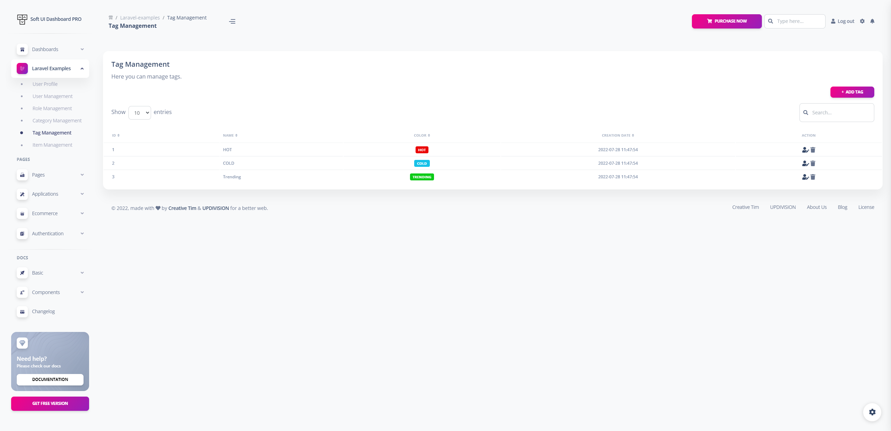](https://soft-ui-dashboard-pro-tall.creative-tim.com/laravel-examples/tag)

| Item Management | Dashboard | Virtual Reality |
| --- | --- | --- |
| [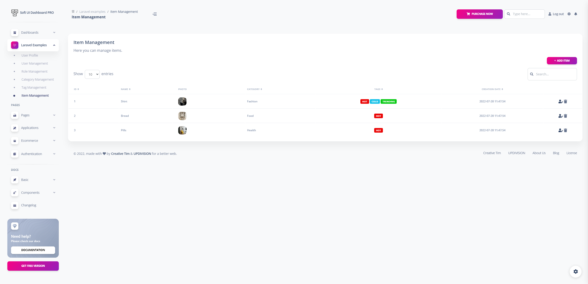](https://soft-ui-dashboard-pro-tall.creative-tim.com/laravel-examples/items) | [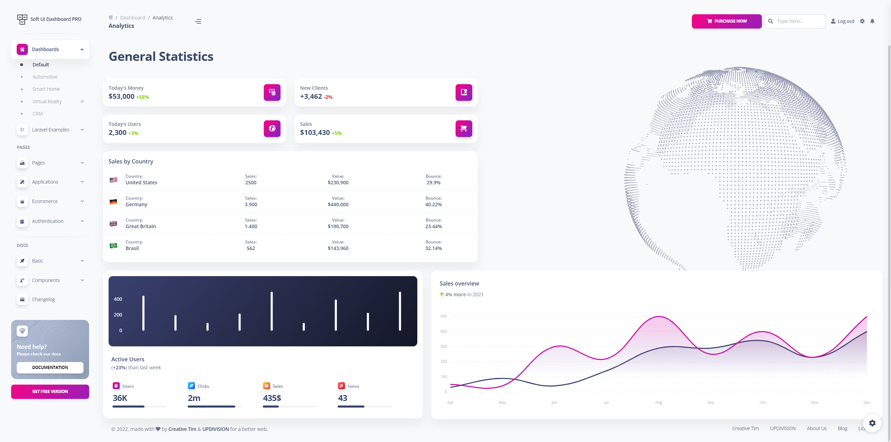](https://soft-ui-dashboard-pro-tall.creative-tim.com/dashboard/analytics) | [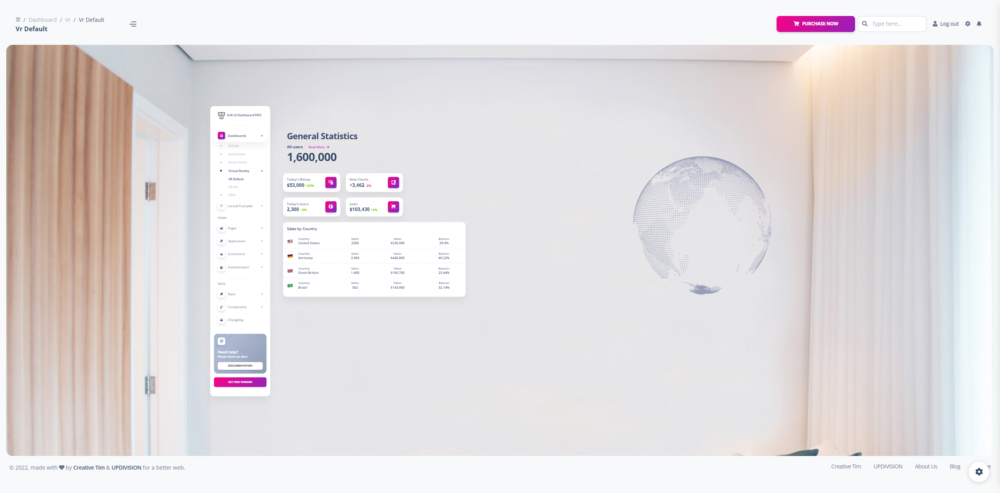](https://soft-ui-dashboard-pro-tall.creative-tim.com/dashboard/vr/vr-default)
[View More](https://soft-ui-dashboard-pro-tall.creative-tim.com/dashboard/analytics)

## Documentation
The documentation for the Soft UI Dashboard TALL is hosted at our [website](https://www.creative-tim.com/learning-lab/tailwind/html/quick-start/soft-ui-dashboard/).

### Login
If you are not logged in you can only access this page or the Sign Up page. The default url takes you to the login page where you use the default credentials **admin@softui.com** with the password **secret** but you can change them with the credentials for creator and for member. Logging in is possible only with already existing credentials. For this to work you should have run the migrations. The user also has the option to choose if he wants to be remembered or not.

The `App/Http/Livewire/Auth/Login.php` handles the logging in of an existing user.

```
    public function login()
    {
        if (auth()->attempt(['email' => $this->email, 'password' => $this->password], $this->remember_me)) {
            $user = User::where(["email" => $this->email])->first();
            auth()->login($user, $this->remember_me);
            return redirect(RouteServiceProvider::HOME);
        } else {
            return $this->addError('email', trans('auth.failed'));
        }
    }

```

### Register
You can register as a user by filling in the name, email, role and password for your account. For your role you can choose between Admin, Creator and Member. It is important to know that an admin user has access to all the pages and actions, can delete, add and edit another users, other roles, items, tags or categories; a creator user has acces to category, tag and item management, but can not add, edit or delete other users; a member user has access to the item management but can not take any actions. You can do this by accessing the sign up page from the "**Sign Up**" button in the top navbar or by clicking the "**Sign Up**" button from the bottom of the log in form. Another simple way is adding **/sign-up** in the url.

The `App/Http/Livewire/Auth/Register.php` handles the registration of a new user.

```
    public function register()
    {
        $this->validate();

        $user = User::create([
            'name' => $this->name,
            'email' => $this->email,
            'password' => Hash::make($this->password),
            'role_id' => $this->role_id,
        ]);

        auth()->login($user);

        return redirect(RouteServiceProvider::HOME);
    }
```

### Forgot Password
If a user forgets the account's password it is possible to reset the password. For this the user should click on the "**here**" under the login form.

The `App/Http/Livewire/Auth/ForgotPassword.php` takes care of sending an email to the user where he can reset the password afterwards.

```
    public function recoverPassword()
    {
        $this->validate();
        $user = User::where('email', $this->email)->first();
        if ($user) {
            $this->notify(new ResetPassword($user->id));
            return back()->with('status', "An email for resetting your password has been sent!");
        } else {
            return back()->with('email', "We could not find any user with that email address.");
        }
    }
```

### Reset Password
The user who forgot the password gets an email on the account's email address. The user can access the reset password page by clicking the button found in the email. The link for resetting the password is available for 12 hours. The user must add the new password and confirm the password for his password to be updated. The user is redirected to the login page.

The `App/Http/Livewire/Auth/ResetPassword.php` helps the user reset the password.

```
    public function resetPassword()
    {
        $this->validate();
        $existingUser = User::where('email', $this->email)->first();
        if ($existingUser && $existingUser->id == $this->urlID) {
            $existingUser->update([
                'password' => Hash::make($this->password)
            ]);
            redirect()->route('login')->with('status', 'Your password has been reset!');
        } else {
            return back()->with('email', "We could not find any user with that email address.");
        }
    }
```

### My Profile
The profile can be accessed by a logged in user by clicking "**User Profile**" from the sidebar. The user can add information like phone number, location or change name, email and password.

The `App/Http/Livewire/LaravelExamples/Profile/Edit.php` handles the user's profile information.

```
    public function update()
    {
        $this->validate();

        if ($this->picture) {

            $this->validate([
                'picture' => 'mimes:jpg,jpeg,png,bmp,tiff |max:4096',
            ]);

            $currentAvatar = auth()->user()->picture;

            if ($currentAvatar !== 'profile/team-1.jpg' && $currentAvatar !== 'profile/team-2.jpg' && $currentAvatar !== 'profile/team-3.jpg' && !empty($currentAvatar)) {

                unlink(storage_path('app/public/' . $currentAvatar));
                $this->user->update([
                    'picture' => $this->picture->store('profile', 'public')
                ]);
            } else {
                $this->user->update([
                    'picture' => $this->picture->store('profile', 'public')
                ]);
            }
        }
        $this->user->save();

        return back()->withStatus('Your profile has been successfully updated!');
    }
```

### User Management
The user management can be accessed by clicking "**User Management**" from the **Laravel Examples** section from the sidebar. This page is available for users with the **Admin** role and the user is able to **add**, **edit** and **delete** other users. For adding a new user you can press the "**+ Add User**". If you would like to edit or delete an user you can click on the **Action** column. It is also possible to sort the fields or to search in the fields.

On the page for adding a new user you will find a form which allows you to fill the information. All pages are generated using blade templates.

The `App/Http/Livewire/LaravelExamples/UserManagement/Create.php ` takes care of data validation and creating the new user:

```
    public function store()
    {

        $this->validate();

        User::create([
            'email' => $this->email,
            'name' => $this->name,
            'password' => Hash::make($this->password),
            'picture' => $this->picture->store('profile', 'public'),
            'role_id' => $this->role_id,
        ]);

        return redirect(route('user-management'))->with('status', 'User successfully created.');
    }
```
Once the user pressed **Add user** at the end of the form the new user is added to the table.
For authorizing this action, the following policy has been used `App\Policies\UserPolicy`:
```
        /**
     * Determine whether the authenticate user can manage other users.
     */
    public function manageUsers(User $user)
    {
        return $user->isAdmin();
    }
```

### Role Management
The PRO version allows you to assign roles for users. The default roles are **Admin**, **Creator**  and **Member**. The role management can be accessed by clicking "**Role Management**" from the **Laravel Examples** section of the sidebar. This page is available for users with the **Admin** role and the user is able to **add**, **edit** and **delete** roles. For adding a new role you can press the "**+ Add Role**" button. If you would like to edit or delete a role you can click on the **Action** column. It is also possible to sort the fields or to search in the fields.

On the page for adding a new role you will find a form which allows you to fill the name and the description of the new role.

The `App/Http/Livewire/LaravelExamples/Roles/Create.php ` takes care of data validation and creation of the new role:

```
    public function store()
    {

        $this->validate();

        Role::create([
            'name' => $this->name,
            'description' => $this->description
        ]);

        return redirect(route('role-management'))->with('status', 'Role successfully created.');
    }


```

### Category Management
The theme has some default categories and any **Admin** or **Creator** users can manage these categories. The category management can be accessed by clicking "**Category Management**" from the **Laravel Examples** section of the sidebar. The authenticated user can **add**, **edit** and **delete** categories. For adding a new category you can press the "**+ Add Category**" button. If you would like to edit or delete a category you can click on the **Action** column. It is also possible to sort the fields or to search in the fields.

On the page for adding a new category you will find a form which allows you to fill the name and the description of the new category.

The `App/Http/Livewire/LaravelExamples/Category/Edit.php ` takes care of data validation when changing details of a category:

```
    public function update(){
        
        $this->validate();

        $this->category->update();

        return redirect(route('category-management'))->with('status', 'Category successfully updated.');
    }
```

### Tag Management
The theme has some default tags and any **Admin** or **Creator** users can manage these tags.The tag management can be accessed by clicking "**Tag Managmenet**" from the **Laravel Examples** section from the sidebar. The authenticated user can **add**, **edit** and **delete** tags. For adding a new tag you can press the "**+ Add Tag**" button. If you would like to edit or delete a tag you can click on the **Action** column. It is also possible to sort the fields or to search in the fields.

On the page for adding a new category you will find a form which allows you to fill the name and the description of the new tag and on the edit page you will find a similar form for the changes you wish to make.

The `/resources/views/livewire/laravel-examples/tag/edit.blade.php` is the blade template for editing a tag:

```
                        <div class="w-full max-w-full px-3 mt-4 flex-0">
                            <label class="mb-2 ml-1 font-bold text-size-xs text-slate-700 dark:text-white/80">Tag
                                Color Picker</label>
                            <input wire:model.lazy="tag.color" type="color"
                                class="focus:shadow-soft-primary-outline dark:bg-gray-950 dark:placeholder:text-white/80 dark:text-white/80 text-size-sm leading-5.6 ease-soft block w-full appearance-none rounded-lg border border-solid border-gray-300 bg-white bg-clip-padding p-1 font-normal text-gray-700 outline-none transition-all placeholder:text-gray-500 focus:border-fuchsia-300 focus:outline-none" required>
                            @error('tag.color')
                            <p class="text-size-sm text-red-500">{{ $message }} </p>
                            @enderror
                        </div>
```

### Item Management
Item Management is the most advanced example included in the PRO theme because every item has a picture, has a category and has multiple tags. The item management can be accessed by clicking "**Item Management**" from the **Laravel Examples** section of the sidebar. The authenticated user as an Admin or Creator can **add**, **edit** and **delete** items. For adding a new item you can press the "**+ Add Item**" button. If you would like to edit or delete an item you can click on the **Action** column. It is also possible to sort the fields or to search in the fields. The Member user can not take any actions on the item, he is only able to see the item management table.

On the page for adding a new item you will find a form which allows you to add an image of the item, to fill the name, description of the item, a dropdown to choose the category and a multiselect for the tags.

The `App/Http/Livewire/LaravelExamples/Items/Create.php ` takes care of data validation when adding a new item and of the item creation(see snippet below):

```
      
    public function store()
    {

        $this->validate();

        $item = Item::create([

            'name' => $this->name,
            'category_id' => $this->category_id,
            'description' => $this->description,
            'picture' => $this->picture->store('pictures', 'public'),
            'status' => $this->status,
            'options' => $this->options,
            'homepage' => $this->showOnHomepage ? 1 : 0,
            'date' => Carbon::parse($this->date)->format('Y-m-d')

        ]);

        sort($this->tags_id);
        $item->tag()->sync($this->tags_id, false);

        return redirect(route('item-management'))->with('status', 'Item successfully created.');
    }
```

## File Structure
```
app
├── Console
│   └── Kernel.php
├── Exceptions
│   └── Handler.php
├── Http
│   ├── Controllers
│   │   └── Controller.php
│   ├── Kernel.php
│   ├── Livewire
│   │   ├── Applications
│   │   │   ├── Analytics.php
│   │   │   ├── Calendar.php
│   │   │   ├── Datatables.php
│   │   │   ├── Kanban.php
│   │   │   └── Wizard.php
│   │   ├── Auth
│   │   │   ├── ForgotPassword.php
│   │   │   ├── Login.php
│   │   │   ├── Logout.php
│   │   │   ├── Register.php
│   │   │   └── ResetPassword.php
│   │   ├── Authentication
│   │   │   ├── Error
│   │   │   │   ├── Error404.php
│   │   │   │   └── Error500.php
│   │   │   ├── Lock
│   │   │   │   ├── Basic.php
│   │   │   │   ├── Cover.php
│   │   │   │   └── Illustration.php
│   │   │   ├── Reset
│   │   │   │   ├── Basic.php
│   │   │   │   ├── Cover.php
│   │   │   │   └── Illustration.php
│   │   │   ├── SignIn
│   │   │   │   ├── Basic.php
│   │   │   │   ├── Cover.php
│   │   │   │   └── Illustration.php
│   │   │   ├── SignUp
│   │   │   │   ├── Basic.php
│   │   │   │   ├── Cover.php
│   │   │   │   └── Illustration.php
│   │   │   └── Verification
│   │   │       ├── Basic.php
│   │   │       ├── Cover.php
│   │   │       └── Illustration.php
│   │   ├── Dashboards
│   │   │   ├── Automotive.php
│   │   │   ├── Crm.php
│   │   │   ├── Index.php
│   │   │   ├── SmartHome.php
│   │   │   └── Vr
│   │   │       ├── VrDefault.php
│   │   │       └── VrInfo.php
│   │   ├── Ecommerce
│   │   │   ├── Orders
│   │   │   │   ├── Details.php
│   │   │   │   └── OrderList.php
│   │   │   ├── Overview.php
│   │   │   ├── Products
│   │   │   │   ├── EditProduct.php
│   │   │   │   ├── NewProduct.php
│   │   │   │   ├── ProductPage.php
│   │   │   │   └── ProductsList.php
│   │   │   └── Referral.php
│   │   ├── LaravelExamples
│   │   │   ├── Category
│   │   │   │   ├── Create.php
│   │   │   │   ├── Edit.php
│   │   │   │   └── Index.php
│   │   │   ├── Items
│   │   │   │   ├── Create.php
│   │   │   │   ├── Edit.php
│   │   │   │   └── Index.php
│   │   │   ├── Profile
│   │   │   │   └── Edit.php
│   │   │   ├── Roles
│   │   │   │   ├── Create.php
│   │   │   │   ├── Edit.php
│   │   │   │   └── Index.php
│   │   │   ├── Tag
│   │   │   │   ├── Create.php
│   │   │   │   ├── Edit.php
│   │   │   │   └── Index.php
│   │   │   └── UsersManagement
│   │   │       ├── Create.php
│   │   │       ├── Edit.php
│   │   │       └── Index.php
│   │   └── Pages
│   │       ├── Account
│   │       │   ├── Billing.php
│   │       │   ├── Invoice.php
│   │       │   ├── Security.php
│   │       │   └── Settings.php
│   │       ├── Charts.php
│   │       ├── Messages.php
│   │       ├── Notifications.php
│   │       ├── PricingPage.php
│   │       ├── Profile
│   │       │   ├── Overview.php
│   │       │   ├── Projects.php
│   │       │   └── Teams.php
│   │       ├── Projects
│   │       │   ├── General.php
│   │       │   ├── NewProject.php
│   │       │   └── Timeline.php
│   │       ├── RtlPage.php
│   │       ├── SweetAlerts.php
│   │       ├── Users
│   │       │   ├── NewUser.php
│   │       │   └── Reports.php
│   │       └── Widgets.php
│   └── Middleware
│       ├── Authenticate.php
│       ├── EncryptCookies.php
│       ├── PreventRequestsDuringMaintenance.php
│       ├── RedirectIfAuthenticated.php
│       ├── TrimStrings.php
│       ├── TrustHosts.php
│       ├── TrustProxies.php
│       └── VerifyCsrfToken.php
├── Models
│   ├── Category.php
│   ├── Item.php
│   ├── Role.php
│   ├── Tag.php
│   └── User.php
├── Notifications
│   └── ResetPassword.php
├── Policies
│   ├── CategoryPolicy.php
│   ├── ItemPolicy.php
│   ├── RolePolicy.php
│   ├── TagPolicy.php
│   └── UserPolicy.php
├── Providers
│   ├── AppServiceProvider.php
│   ├── AuthServiceProvider.php
│   ├── BroadcastServiceProvider.php
│   ├── EventServiceProvider.php
│   └── RouteServiceProvider.php
└── View
    └── Components
        └── Layouts
            ├── App.php
            └── Base.php
bootstrap
├── app.php
├── cache
└── helpers.php
....

```

## Browser Support
At present, we officially aim to support the last two versions of the following browsers:

    


## Reporting Issues
We use GitHub Issues as the official bug tracker for the Soft UI Dashboard PRO TALL. Here are some advices for our users that want to report an issue:

1. Make sure that you are using the latest version of the Soft UI Dashboard PRO TALL. Check the CHANGELOG from your dashboard on our [website](https://www.creative-tim.com/product/soft-ui-dashboard-pro-tall).
2. Providing us reproductible steps for the issue will shorten the time it takes for it to be fixed.
3. Some issues may be browser specific, so specifying the browser you encountered the issue on might help.


## Licensing
- Copyright 2022 [Creative Tim](https://www.creative-tim.com?ref=readme-softuiprotall-readme)
- Creative Tim [license](https://www.creative-tim.com/license?ref=readme-softuiprotall-readme)

## Useful Links
- [Tutorials](https://www.youtube.com/channel/UCVyTG4sCw-rOvB9oHkzZD1w)
- [Affiliate Program](https://www.creative-tim.com/affiliates/new) (earn money)
- [Blog Creative Tim](http://blog.creative-tim.com/)
- [Free Products](https://www.creative-tim.com/bootstrap-themes/free) from Creative Tim
- [Premium Products](https://www.creative-tim.com/bootstrap-themes/premium?ref=softuiprotall-readme) from Creative Tim
- [React Products](https://www.creative-tim.com/bootstrap-themes/react-themes?ref=softuiprotall-readme) from Creative Tim
- [VueJS Products](https://www.creative-tim.com/bootstrap-themes/vuejs-themes?ref=softuiprotall-readme) from Creative Tim
- [More products](https://www.creative-tim.com/bootstrap-themes?ref=softuiprotall-readme) from Creative Tim
- Check our Bundles [here](https://www.creative-tim.com/bundles??ref=softuiprotall-readme)

### Social Media

### Creative Tim
Twitter: <https://twitter.com/CreativeTim?ref=softuiprotall-readme>

Facebook: <https://www.facebook.com/CreativeTim?ref=softuiprotall-readme>

Dribbble: <https://dribbble.com/creativetim?ref=softuiprotall-readme>

Instagram: <https://www.instagram.com/CreativeTimOfficial?ref=softuiprotall-readme>

### UPDIVISION:

Twitter: <https://twitter.com/updivision?ref=softuiprotall-readme>

Facebook: <https://www.facebook.com/updivision?ref=softuiprotall-readme>

Linkedin: <https://www.linkedin.com/company/updivision?ref=softuiprotall-readme>

UPDIVISION Blog: <https://updivision.com/blog/?ref=softuiprotall-readme>

## Credits

- [Creative Tim](https://creative-tim.com/?ref=softuiprotall-readme)
- [UPDIVISION](https://updivision.com/?ref=softuiprotall-readme)
